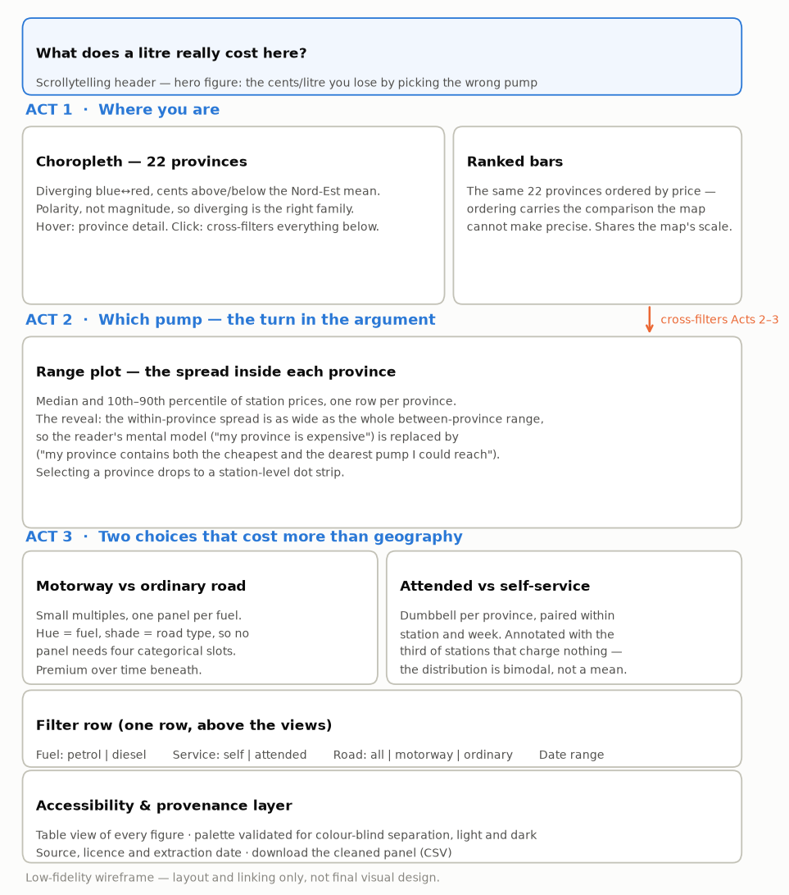

## 1. Project Idea Description

### 1.1 Topic

Fuel is one of the few prices an Italian household sees advertised in half-metre
digits several times a week. Drivers form strong beliefs about it - that the
motorway robs you, that their own province is somehow worse - and almost none of
those beliefs are ever checked, even though Italy publishes the posted price of
every fuel at every one of its ~24,000 stations daily, under an open licence.

This project asks one question:

> **How much does *where* you refuel change what you pay?**

Not why prices move over time, and not what a litre is made of - only the
geography of the price on a given day. That question has more structure inside
it than it first appears, because "where" operates at four scales: which
province you are in, which pump you pick inside it, whether you are on the
motorway, and whether you let someone else hold the nozzle.

The topic is relevant because the data is public, granular, and essentially
never shown to the people it concerns: its only widespread public use is a
cheapest-pump-near-me lookup, which answers a transactional question and teaches
the reader nothing about the structure they are embedded in.

### 1.2 Circumstances

#### 1.2.1 Target audience

Primarily the **general Italian public** - motorists, and readers of visual data
journalism; secondarily local civic-data readers. We assume **no prior
knowledge**: not of oil markets, not of how fuel retail is organised, not of
what a percentile is. Anything further has to be earned inside the piece through
annotation. Readers are assumed to care about one province in particular -
their own - which is a design constraint as much as an audience fact.

#### 1.2.2 Format and medium

An **interactive scrollytelling piece on the web**, desktop-first but
responsive. The argument is sequential - the reader has to believe the
provincial map before it can be undercut - which favours a scrolled narrative;
but the question is also personal, which favours an explorable view. A narrative
that opens into an explorer at the end serves both.

### 1.3 Purpose

Primarily **to explain**, secondarily **to compare**. A feasibility pass over the
2024–2025 extracts suggests three takeaways, in order:

1. Provincial fuel prices in Nord-Est really do differ, by about nine cents a
   litre between the cheapest and the dearest.
2. **But that is not the biggest gap the reader faces.** The spread between
   neighbouring pumps *inside* a single province is just as wide - so "my
   province is expensive" is the wrong mental model, and "my province contains
   both the cheapest and the dearest pump I could reach" is the right one.
3. Two choices the driver actually controls - motorway or not, attended or
   self-service - each cost more than the entire geographic range.

The reversal in point 2 is the reason the project is worth doing rather than
merely worth plotting. It takes a belief the reader arrives with and replaces
it with a more useful one. These magnitudes are provisional until the full
cleaning in Deliverable 2; the final solution will report the evidence found
rather than force these hypotheses, and any departure from this proposal will be
documented in the later deliverables.

## 2. Project Data

| Source | Role | Access |
|---|---|---|
| **MIMIT Osservaprezzi Carburanti** - daily prices + station registry | core dataset | open portal, IODL 2.0, quarterly archives since 2015 |
| **openpolis/geojson-italy** | province boundaries (ISTAT-derived) | GitHub, CC-BY |

**Why these data fit.** The MIMIT archive carries all three axes the question
needs at once: *space* (every station geocoded, with a motorway flag), *time*
(daily, eleven years) and *product* - plus a self-service versus attended flag
that most price datasets lack, and which turns out to carry the largest effect
in the project. No second source is required, which is itself a virtue: the
argument does not rest on a join the reader has to take on trust.

**Preprocessing is substantial.** A feasibility check on the 2024–2025 extracts
surfaced issues that make cleaning a first-class part of the work: the fuel-name
field is free text with 59 commercial variants; methane and LNG are priced per
kilogram and cannot be pooled with per-litre fuels; the field separator differs
between the archive and the live feed; and some registry rows carry separators
inside the station name. None is a blocker; all will be documented in Deliverable 2.

**Known limitations.** These are *posted* prices, self-reported by operators -
not transaction prices, and not weighted by how much fuel each station sells, so
a station counts as much as its neighbour regardless of throughput.
Friuli-Venezia Giulia operates a regional discount for residents that posted
prices do not reflect. Station coordinates in the registry may also carry errors,
which matters for a map and will be validated against province boundaries.

**Scope.** Nord-Est (ISTAT NUTS-1: Trentino-Alto Adige, Veneto,
Friuli-Venezia Giulia, Emilia-Romagna - 22 provinces, ~5,300 stations), over
2024–2025, sampled one day per week. Tractable, while preserving the variation
the question needs: Alpine, plain, coastal and border provinces, dense motorway
corridors and rural areas. Weekly sampling costs nothing, because the question
is geographic rather than dynamic - though we will check that the main patterns
hold across different weekdays rather than assuming the sampled day is
representative.

## 3. Project Definition

### 3.1 Potential views and visual encodings

Three acts (see the wireframe, Figure 1):

**Act 1 - Where you are.** A **choropleth** of the 22 provinces on a *diverging*
scale (cents above or below the Nord-Est mean: the job is polarity, not
magnitude, so diverging is the right family), paired with **ranked bars** of the
same 22 values. The map makes the pattern spatial; the bars make it precise.
Ordering the bars by price rather than alphabetically is itself an encoding.

**Act 2 - Which pump.** A **range plot**: one row per province, showing the
median and the 10th–90th percentile of station prices within it. This is where
the argument turns, so it gets a full-width panel and the most annotation.
Selecting a province drops to a station-level dot strip.

**Act 3 - Two choices that cost more.** **Small multiples** for the motorway
premium (one panel per fuel, hue carrying the fuel and shade the road type, so
no panel ever needs four categorical slots), and a **dumbbell** per province for
self-service versus attended.

*Deliberately rejected:* a dual-axis chart of any kind, and a dot map of all
5,300 stations at once - the latter looks impressive and communicates nothing,
since at national zoom it renders population density rather than price.

### 3.2 Data requirements

Core variables: station id, date, fuel label, price, self-service flag; plus
province, road type, brand and coordinates from the registry. Derived variables
we expect to need:

- **Harmonised product**, collapsing free-text labels onto a small controlled
  set, with premium grades kept *separate* so that a station selling Blue Diesel
  is not read as an expensive station.
- **Deviation from the regional mean**, in cents, for the choropleth.
- **Within-province spread** (10th–90th percentile), computed within a week and
  then averaged, so that prices moving over time do not inflate it.
- **Paired service gap**, computed within a station and week, so the attended
  premium cannot be an artefact of which stations offer attended service.

**Selecting without distorting.** Two rules apply throughout: statistics are
computed within a week before being averaged across weeks, and paired
comparisons are made within a station. Both guard against composition effects
that would otherwise masquerade as geography.

### 3.3 Highlighting key features

- **Colour by job.** Diverging for deviation from a mean, one hue for magnitude,
  a fixed categorical order elsewhere. 
- **Annotation over legend.** The comparison that carries the argument - the
  between-province range against the within-province spread - is stated in
  words on the chart itself, not left for the reader to compute.
- **Cents into money the reader spends.** Every headline gap is labelled twice:
  in cents per litre, and as the difference on a typical 50-litre refill. A
  reader who has no feel for "nine cents a litre" has a very clear feel for
  "four and a half euros a tank", and it costs one line of text.
- **Ordering as encoding.** Provinces ranked by value, never alphabetically.
- **Layering for clutter.** 5,300 stations are aggregated to province and
  revealed only on selection.
- **One idea per screen**, which is the reason for the scrollytelling structure.

## 4. Expected Challenges

**The reversal has to land without a statistical apparatus.** "The within-province
spread is comparable to the between-province range" is the whole argument, and
it is a claim about two dispersions. Making that legible to a reader who does
not know what a percentile is - without dumbing it down or hiding behind a box
plot - is the central design problem.

**Small motorway sample.** 105 motorway stations against 5,224 ordinary ones is
an unbalanced comparison - and of those 105, only around 100 report prices in a
given week. Medians rather than means, and stating the sample size, are the
mitigation.

{width=88%}

## Data Sources

- MIMIT, *Carburanti - Archivio storico dei prezzi praticati e dell'anagrafica
  degli impianti*:
  <https://www.mimit.gov.it/it/open-data/elenco-dataset/carburanti-archivio-prezzi>
- Openpolis, *Italian administrative boundaries*:
  <https://github.com/openpolis/geojson-italy>
