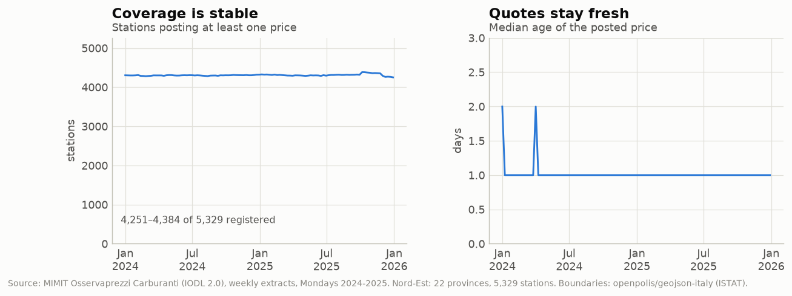
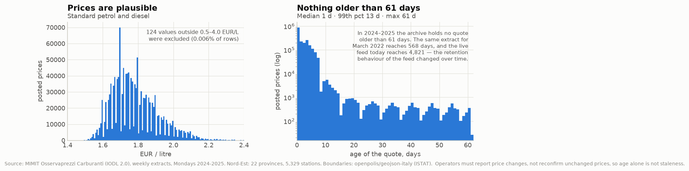
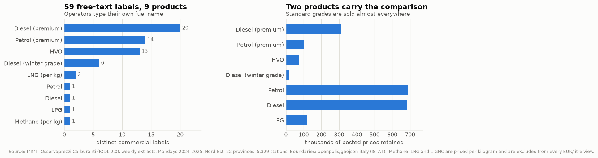
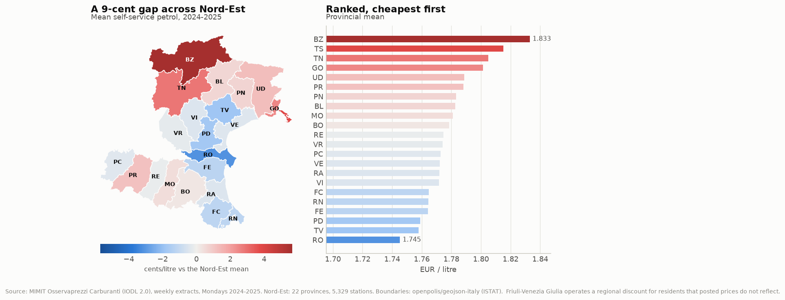
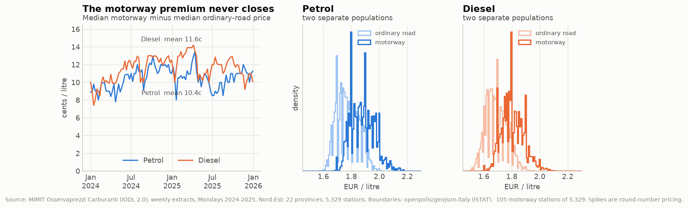
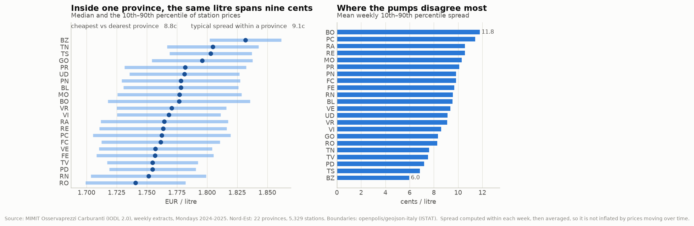
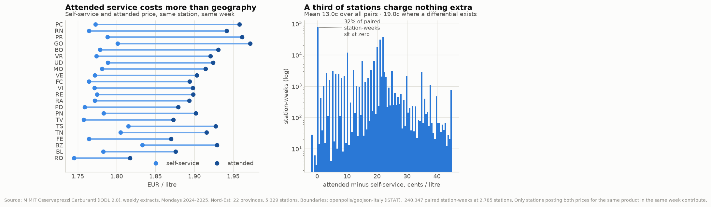
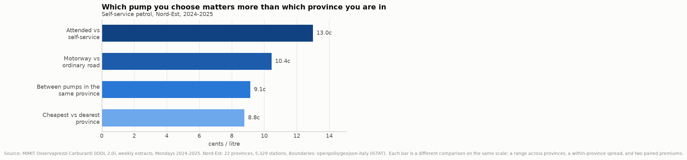

## 1. Scope and purpose

This report documents the data behind a single question - *how much does where
you refuel change what you pay?* - restricted to the 22 provinces of ISTAT
NUTS-1 **Nord-Est** (Trentino-Alto Adige, Veneto, Friuli-Venezia Giulia,
Emilia-Romagna) over **2024–2025**, sampled **one day per week (Monday)**.

The restriction is deliberate. The question is geographic, not dynamic, so daily
resolution buys nothing; and, as Section 5.3 shows, the 2024–2025 window is
internally consistent in a way the full 2015–2026 archive is not.

**Headline:** 105 weekly extracts yield **2,000,810 usable price observations**
(97.14% of the Nord-Est rows) across **5,329 registered stations**, with only
125 rows discarded for quality reasons. The dataset is in good condition; its
real difficulties are semantic (free-text fuel names, mixed units) rather than
structural.

## 2. Sources and provenance

| Source | Content | Licence |
|---|---|---|
| MIMIT *Carburanti - archivio storico prezzi* | daily station prices, quarterly `.tar.gz`, 2015 Q1– | IODL 2.0 |
| MIMIT *Carburanti - anagrafica impianti attivi* | station registry with coordinates | IODL 2.0 |
| openpolis/geojson-italy | province boundaries (ISTAT-derived) | CC-BY |

Prices are reported to the Ministry by operators under art. 51 of Law 99/2009.
Each daily file is an extract of the prices valid at 08:00. Archive URLs follow
`opendatacarburanti.mise.gov.it/categorized/{dataset}/{year}/{year}_{q}_tr.tar.gz`.

**Verification.** Five of the 105 weekly price files were re-extracted from
freshly downloaded quarterly archives and compared by MD5 against the working
copies. All five matched byte-for-byte.

## 3. Structure of the raw data

**Prices** (`prezzo_alle_8-YYYYMMDD.csv`) - line 1 is a free-text extraction
stamp, line 2 the header, delimiter `;`:

| Field | Type | Notes |
|---|---|---|
| `idImpianto` | int | joins to the registry |
| `descCarburante` | text | **free text**, see §5.4 |
| `prezzo` | float | EUR/litre, or EUR/kg for methane and LNG |
| `isSelf` | 0/1 | 1 = self-service, 0 = attended |
| `dtComu` | datetime | when the operator filed this price |

**Registry** (`anagrafica_impianti_attivi-YYYYMMDD.csv`) - same two-line
preamble, delimiter `;`, ten fields: `idImpianto`, `Gestore`, `Bandiera`,
`Tipo Impianto`, `Nome Impianto`, `Indirizzo`, `Comune`, `Provincia`,
`Latitudine`, `Longitudine`. `Tipo Impianto` is a clean binary in this period:
`Stradale` or `Autostradale`.

A national daily file holds ~93,000 price rows across ~24,000 stations. Eight
registry snapshots were taken, one per quarter, growing from 22,821 to 24,462
national rows over the two years.

## 4. Construction of the analysis panel

The pipeline (`scripts/`, ~600 lines of Python) runs in five stages:

1. **`geo.load_registry`** - parse all eight snapshots, restrict to Nord-Est,
   derive region, motorway flag, harmonised brand, and a geocode validity flag;
   take the union across snapshots keeping the most recent record per station.
2. **`build_panel`** - read the 105 weekly price files, join the registry,
   harmonise fuel labels, apply the documented filters, and write the panel plus
   a machine-readable QC record (`data/processed/qc.json`).
3. **`analyse`** - compute the four geographic views.
4. **`figures`** / **`wireframe`** - render.

Two methodological rules are applied throughout, because both guard against
composition effects that would otherwise be mistaken for geography:

- Statistics are computed **within a week** and then averaged across weeks.
  Averaging raw prices over two years would let a province that happens to
  report more often during expensive weeks look expensive.
- Paired comparisons (the attended premium) are made **within a station**, so
  the gap cannot be an artefact of *which* stations offer attended service.

## 5. Data quality assessment

### 5.1 Coverage

All 105 expected Mondays are present; none is missing. Between 4,301 and 4,439
Nord-Est stations post at least one price in any given week, out of 5,329
registered. Over the whole period **5,018 stations report at least once**, so
**311 registered stations (5.8%) are never observed quoting a price** - they are
listed as active but silent. This is a real limitation: the "provincial mean" is
a mean over stations that report, not over stations that exist.



### 5.2 Price plausibility

Only **124 rows (0.006%)** fall outside a plausibility band of 0.5–4.0 EUR/litre
and are removed; one further row has an unparseable station id. Nothing is
missing: `prezzo` parses for every remaining row. The retained distribution is
well-behaved, with pronounced spikes at round numbers (1.700, 1.800, 1.900) that
are a genuine pricing behaviour rather than a defect.

For context, the *live* feed downloaded on 2026-08-04 carries values of 0.100
and 8.888 - placeholders rather than prices. The band is set to catch exactly
these without touching any real fuel price.



### 5.3 Quote age - and a regime change in the archive

Operators are required to report price *changes*, not to reconfirm unchanged
prices, so an old `dtComu` is **not by itself evidence of a stale record**. We
therefore flag at 60 days and drop only beyond 365.

In this window the filter never fires. Median quote age is **1 day**, the 95th
percentile 6 days, and the maximum **61 days**. No row is older than that.

That cleanliness is a property of *this window*, not of the dataset:

| Extract | max age | 99th pct | rows > 60 d |
|---|---|---|---|
| Archive, 2022-03-17 | 568 d | 453 d | 6,201 |
| Archive, 2024–2025 (this panel) | 61 d | 13 d | 0 |
| Live feed, 2026-08-04 | 4,821 d | 19 d | 235 |

MIMIT's retention behaviour evidently changed between 2022 and 2024, and the
live feed behaves differently again. **Any project spanning the full archive
would have to model this discontinuity;** scoping to 2024–2025 avoids it, and
that is part of why the window was chosen.

One caveat: the age comparison must be made date-to-date, not
timestamp-to-timestamp. The 08:00 extract carries quotes filed up to 08:15 the
same morning, so a naive comparison against midnight scores 43% of rows as
"filed in the future". This was an early bug in our pipeline, caught because the
implied exclusion rate was implausible.

### 5.4 Fuel labels: the main semantic problem

`descCarburante` is free text. Across the study period it takes **59 distinct
values** (56 after case-folding) for what are really **nine products**. Diesel
alone appears under 20 commercial names - `Blue Diesel`, `Hi-Q Diesel`,
`Supreme Diesel`, `Excellium Diesel`, `Gasolio Oro Diesel`, and so on.

Harmonisation is an explicit lookup table (`fuels.py`), not a fuzzy rule, so an
unrecognised label surfaces as an error rather than being silently absorbed.
After harmonisation **zero rows are unmapped**.

Two decisions matter for the analysis:

- **Premium grades are kept separate from standard ones.** Pooling them would
  make a station that happens to sell Blue Diesel look expensive when it is
  simply selling a different product.
- **Winter-grade diesel** (`Gasolio artico`, `Gasolio Alpino`, …) is separated
  too: it is sold mainly in Alpine provinces and priced above standard diesel,
  so pooling it would bias precisely the provinces being compared.

**Mixed units.** Methane, LNG and L-GNC are priced **per kilogram**, not per
litre. These **58,784 rows (2.854%)** are excluded from every EUR/litre view.
This is the single largest exclusion in the pipeline, and it is a unit
incompatibility rather than a quality failure.



### 5.5 Registry quality

- **Embedded separators.** 34 rows across the eight snapshots carry a stray `;`
  inside the station name or address. Because `idImpianto` is always first and
  the coordinates always last, these are *recoverable* by anchoring from both
  ends; we repair them rather than drop them. **Zero rows are unrecoverable.**
- **Geocoding.** Only **10 stations (0.19%)** have coordinates that fall outside
  a Nord-Est bounding box or sit at (0,0). They are excluded from spatial views.
- **Churn.** 4,267 of 5,329 stations appear in all eight snapshots; 225 appear in
  only one. Because a single snapshot cannot resolve every id, the registry is
  built as a union across snapshots - using only the latest snapshot would have
  silently dropped historical stations.
- **Rebranding.** 58 stations change `Bandiera` during the period. Brand is
  therefore a property of the *latest* record, and brand-level comparisons
  should be read with that in mind.

### 5.6 Exclusion ledger

| Filter | Rows | % of Nord-Est rows |
|---|---:|---:|
| Unparseable station id | 1 | 0.000 |
| Price missing | 0 | 0.000 |
| Price outside 0.5–4.0 EUR/L | 124 | 0.006 |
| Fuel label unmapped | 0 | 0.000 |
| Priced per kilogram (methane, LNG) | 58,784 | 2.854 |
| Service flag unknown | 0 | 0.000 |
| Quote older than 365 days | 0 | 0.000 |
| **Retained** | **2,000,810** | **97.14** |

## 6. Exploratory analysis

The panel covers 5,008 geolocated stations that reported at least once - 101 of
them on the motorway. Composition: Veneto 2,241 stations, Emilia-Romagna 2,065,
Friuli-Venezia Giulia 587, Trentino-Alto Adige 436; by brand, Eni 1,153,
IP 751, unbranded *pompe bianche* 622, Q8 562, Esso 496, Tamoil 324, Shell 26,
and 1,395 others.

All figures below use **standard self-service grades**, the products nearly
every station sells and therefore the only ones comparable across 5,000 pumps.

### 6.1 Between provinces

Mean self-service petrol ranges from **€1.745 in Rovigo to €1.833 in Bolzano** -
a spread of **8.8 cents**. Diesel behaves similarly (€1.660 to €1.758, 9.8
cents). The pattern is coherent rather than noisy: Alpine and border provinces
(BZ, TN, TS, GO) are dear, the Po plain (RO, TV, PD, FE) is cheap.



### 6.2 Motorway

The motorway premium averages **10.4 cents** for petrol and **11.6** for diesel,
and never closes: the weekly minimum across two years is 7.4 cents. The two
populations are almost disjoint in the distribution plot. Note the small sample
- 101 reporting motorway stations against ~4,900 ordinary - which is why medians
are used throughout.



### 6.3 Within provinces - the result that reframes the question

Within a single province and a single week, the 10th–90th percentile of station
prices spans **9.1 cents on average** - *as wide as the entire 8.8-cent range
between the cheapest and dearest province*. Bologna is the most dispersed
(11.8c), Bolzano the least (6.0c): Bolzano is uniformly expensive, whereas
Bologna contains both cheap and dear pumps.

The consequence for the visualization is direct. A choropleth alone would leave
the reader with "my province is expensive"; the data supports "my province
contains both the cheapest and the dearest pump I could reach", which is both
more accurate and more actionable.



### 6.4 Attended versus self-service

Measured within station and week, across **240,347 paired station-weeks at 2,785
stations**, attended service costs **13.0 cents** more on average - larger than
any other gap in the study.

That mean, however, describes almost no real station. The distribution is
strongly **bimodal**: **32% of paired station-weeks show no differential at
all**, while among those that do the gap averages **19.0 cents**. Roughly 30% of
stations never differentiate. Reporting only the mean would misrepresent both
groups, so the figure shows the shape.



### 6.5 Synthesis

{width=80%}

Ordered by size, the four gaps a driver faces are: attended service 13.0c,
motorway 10.4c, within-province spread 9.1c, and between-province range 8.8c.
**Geography matters least.**

## 7. Limitations

1. **Posted, not transacted, and unweighted.** Prices are what operators
   advertise, not what drivers pay, and every station counts equally regardless
   of throughput. Provincial means are means over pumps, not over litres.
2. **Silent stations.** 311 registered stations never report; if silence
   correlates with price, provincial means are biased.
3. **Friuli-Venezia Giulia** operates a regional discount for residents that
   posted prices do not reflect, so UD, GO, TS and PN overstate what a resident
   actually pays.
4. **Weekly Monday sampling** is appropriate for a geographic question but
   would be inadequate for a dynamic one.
5. **Brand is time-collapsed** to the latest snapshot, affecting the 58
   rebranded stations.
6. **The clean age profile does not generalise** beyond 2024–2025 (§5.3).

## 8. Reproducibility

```
scripts/config.py       scope, paths, thresholds
scripts/fuels.py        59 labels -> 9 products; per-kg products flagged
scripts/geo.py          registry parsing, repair, geocode QC, boundaries
scripts/build_panel.py  105 weekly files -> panel + qc.json      (~95 s)
scripts/analyse.py      the four geographic views
scripts/figures.py      figures 01-08
scripts/wireframe.py    figure 09
```

Running `build_panel.py`, `analyse.py`, `figures.py` and `wireframe.py` in that
order regenerates every number and figure in this report from the raw CSVs.
Every threshold is a named constant in `config.py`; every exclusion is counted
into `data/processed/qc.json` rather than applied silently. Environment: Python
3.12, pandas 3.0.5, matplotlib 3.11.1, numpy 2.5.1, pyarrow 25.0.0.
